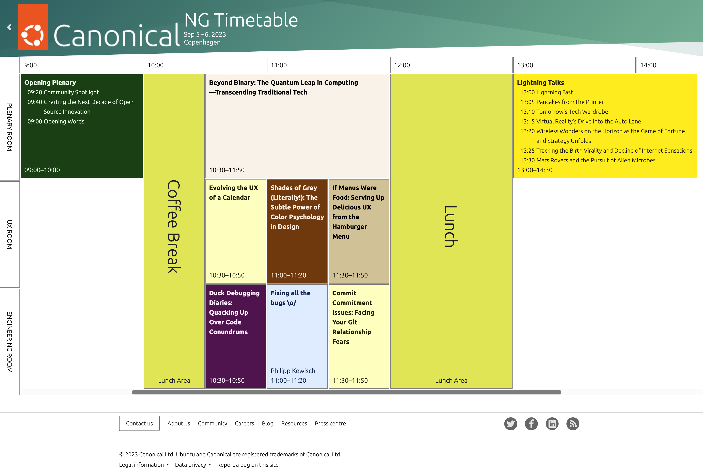
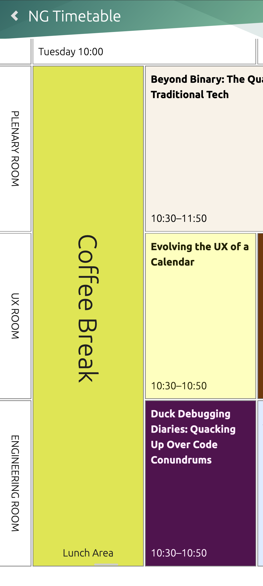

NG Timetable for Indico
=======================

A fresh take on the timetable in Indico. It is simple yet powerful. Works nicely on mobile which
most folks will use during the in-person event.

Note that the granularity of this timetable is 30 minutes, which allows to maximize space. You
should have at most one contribution per 30 minute interval. If you need more, use a Contribution with
Subcontributions (e.g. Lightning Talks)

Desktop
-------

Mobile
------

